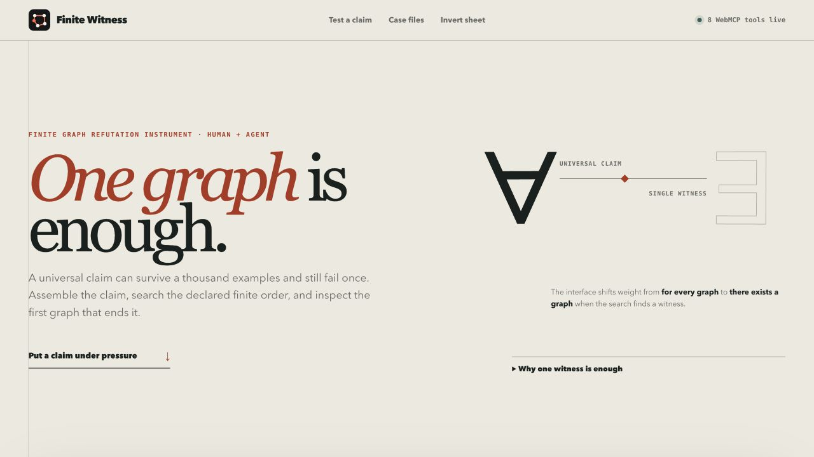

# Finite Witness

**One graph is enough.**

Finite Witness is a local-first finite graph conjecture laboratory built for the [OpenAI WebMCP Challenge](https://webmcp.devpost.com/). Its interface is a `∀ → ∃` pressure rig: a person assembles a universal claim, ordered graph search applies pressure, and the first counterexample shifts the page toward a concrete existential witness. An AI agent can configure the same claim, run the same engine, preserve the witness, apply a repair, and retrieve a deterministic certificate through eight WebMCP tools.

The agent handles structured search and bookkeeping. The person sees the actual graph, checks the metrics, and decides how the mathematical claim should change. Both work through one live, inspectable sheet.

## Live app

[Open Finite Witness](https://f0909172434.github.io/finite-witness-webmcp/)

No account, API key, build step, or backend is required. Saved witnesses stay in the current browser's local storage.

## Interface concept



The visual system follows the mathematical argument. The universal quantifier begins with most of the weight. The ordered search line tightens as premises are added. When a counterexample appears, a single red `∃` takes over the consequence field. Candidate repairs then feed that witness back into the next universal statement. The paper, ruled lines, serif mathematics, black ink, and one witness-red accent keep every screen part of the same proof instrument.

## Human and agent workflow

1. Assemble a finite simple graph conjecture and read the live universal statement.
2. Search labeled graphs with at least three vertices in increasing order, stopping at the first counterexample and using six vertices as the upper bound.
3. Inspect the first counterexample and its exact graph metrics.
4. Save the witness with the claim and search count.
5. Feed the witness into a candidate repair and immediately test the revised statement again.
6. Copy a deterministic counterexample certificate or share the entire experiment by URL.

Finite Witness is an educational finite search tool. A claim surviving a bounded search is evidence, not a proof.

## WebMCP implementation

The top-level page registers eight JavaScript WebMCP tools through `document.modelContext.registerTool`:

| Tool | Purpose |
| --- | --- |
| `get_workspace_state` | Read the visible claim, bound, latest result, and saved evidence count. |
| `load_demo_scenario` | Put a curated conjecture into the shared workbench. |
| `configure_conjecture` | Change any selected assumptions, conclusion, and search bound. |
| `search_counterexample` | Run the exhaustive engine and update the shared graph visualization. |
| `save_current_witness` | Persist the exact witness and search record in browser-local storage. |
| `suggest_conjecture_repairs` | Return stronger premises with machine-readable patches and the resulting next claims. |
| `apply_conjecture_repair` | Apply a repair in the visible workspace and optionally run the next exhaustive search. |
| `get_counterexample_certificate` | Return the claim, edge mask, edge list, metrics, enumeration order, and exact search counts. |

The registrations live in [`src/webmcp.js`](src/webmcp.js). Tool handlers call the same application functions used by the human interface; there is no parallel agent-only implementation. Each result includes enough state to verify what changed in the visible page.

```js
await document.modelContext.registerTool({
  name: "search_counterexample",
  description: "Exhaustively search labeled finite simple graphs in increasing vertex order for the smallest counterexample to the visible conjecture.",
  inputSchema: {
    type: "object",
    properties: {},
    required: [],
    additionalProperties: false,
  },
  execute: async () => workspace.search("agent"),
});
```

The app checks for browser support before registration and remains fully usable in ordinary browsers. Tools are registered only in the top-level page, matching the current ChatGPT in-app browser support described in the official [Site tools guide](https://learn.chatgpt.com/docs/webmcp).

## Search engine

Graphs are represented by an integer edge mask. The engine checks the `2^(n choose 2)` labeled simple graphs for each vertex count in edge-mask order. It computes connectivity, degree sequence, triangle count, bipartiteness, diameter, cycle structure, and perfect matching existence. A dedicated Web Worker keeps the visible interface responsive during enumeration.

The first admissible graph that violates the selected conclusion is returned as the minimal witness by vertex count. The app checks every earlier graph in the declared order, then stops at that witness. It reports the requested upper bound, exact stopping mask, total candidate prefix tested, and number of admissible graphs in that prefix; it does not imply that larger graphs were enumerated after a witness was found.

## Reproducibility and evidence

Every found witness receives a deterministic certificate ID. Its certificate contains the normalized conjecture, exact labeled edge mask and edge list, graph metrics, bounded enumeration order, candidate count, and admissible-graph count. The certificate can be copied from the visual workbench or read through WebMCP.

“Copy experiment link” serializes the normalized conjecture into the URL. Opening that link restores the same visible controls without a server or account. Saved witnesses include their certificate and can be exported together as a versioned JSON evidence bundle.

Changing any visible assumption clears the old result immediately. This prevents a witness for an earlier conjecture from being displayed or saved as evidence for a revised one.

## Run locally

Requirements: Python 3 and a modern browser.

```bash
git clone https://github.com/f0909172434/finite-witness-webmcp.git
cd finite-witness-webmcp
python3 -m http.server 4173
```

Then open `http://127.0.0.1:4173`.

To inspect WebMCP tools, use ChatGPT's in-app browser or enable WebMCP testing in a supported version of Google Chrome.

## Tests

Requirements: Node.js 20 or newer.

```bash
npm test
```

The tests cover graph analysis, minimal counterexample results, repair application, shareable experiment round-trips, configuration normalization, and deterministic certificates.

## Privacy and safety

- No analytics, tracking, cookies, network APIs, or user accounts.
- No user data leaves the browser.
- Saved evidence uses browser-local storage and can be cleared with site data.
- WebMCP inputs are narrow and validated by JSON Schema.
- Tool outputs distinguish finite evidence from proof.

## AI assistance disclosure

OpenAI Codex was used during the hackathon period to help plan the product, implement and review the HTML, CSS, JavaScript, tests, WebMCP registrations, documentation, and submission materials. The entrant directed the project and is responsible for the submitted work. No hosted model or AI API is used by the running application.

## License

[MIT](LICENSE) © 2026 f0909172434

## Deployment checks

Pull requests and pushes run the graph-engine and evidence tests. The Pages workflow deploys only after those tests pass on `main`, and packages only `index.html`, `styles.css`, `src/`, and `assets/`.
